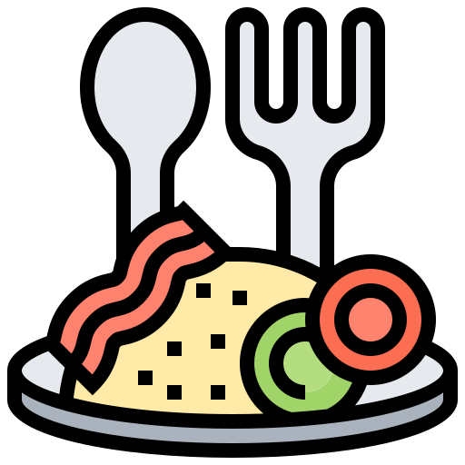

<a name="readme-top"></a>

<!-- PROJECT LOGO -->
<br />
<div align="center">
  <a href="https://github.com/akg07/Meals-App">
    
  </a>

  <h3 align="center">Meals App</h3>

  <p align="center">
    An Meals app which makes call to some apis to fetch meal details and show it on HTML page and a fav page also. Tech stack: HTML, CSS, Vanila Javascript
    <br />
    <a href="https://github.com/akg07/Meals-App"><strong>Explore the docs »</strong></a>
    <br />
    <br />
    <a href="https://github.com/akg07/Meals-App#readme">View Demo</a>
    ·
    <a href="https://github.com/akg07/Meals-App/issues">Report Bug</a>
    ·
    <a href="https://github.com/akg07/Meals-App/issues">Request Feature</a>
  </p>
</div>


<!-- ABOUT THE PROJECT -->
## About The Project

#### Live link for website
https://meal-app-akg.netlify.app/

#### Features
1. ##### Home Page
    * Search any meal from the API and display the search results on the frontend (as I type the search results should update, just like Google does for suggestions).
    
    * Each search result of the meal should have a favourite button, clicking on which the meal should be added to “My favourite meals” (a list).
    
    * On clicking any particular search result (any meal), open a new page with more information about that meal(meal page

2. ##### Meal Detail Page
    * Should show information about the meal like its name, photo, instructions, etc (these are must, rest you can add if you want).

3. ##### My favourite meals Page
    * Display a list of all the favourite meals.
    * Make this list persistent (should have the same number of meals before and after closing the browser/refreshing the browser).
    * Remove from favourites button: Each meal should have remove from favourites button, clicking on which should remove that meal from the list.


<p align="right">(<a href="#readme-top">back to top</a>)</p>

### Google like search functionality works only for below meals
```
    "Baked salmon with fennel & tomatoes",
    "Boulangere Potatoes",
    "Braised Beef Chilli",
    "Breakfast Potatoes",
    "Chilli prawn linguine",
    "Creamy Tomato Soup",
    "French Onion Chicken with Roasted Carrots & Mashed Potatoes",
    "Honey Balsamic Chicken with Crispy Broccoli & Potatoes",
    "Lamb Tzatziki Burgers",
    "Lamb tomato and sweet spices",
    "Potato Gratin with Chicken",
    "Skillet Apple Pork Chops with Roasted Sweet Potatoes & Zucchini",
    "Soy-Glazed Meatloaves with Wasabi Mashed Potatoes & Roasted Carrots",
    "Spicy Arrabiata Penne",
    "Spicy North African Potato Salad",
    "Stuffed Lamb Tomatoes",
    "Vegetarian Chilli"
```
<p align="right">(<a href="#readme-top">back to top</a>)</p>

### Sample Images from POSTMAN
Here are some sample images of the CRUD Ops. Have a quick look

#### Home Page
![Home page][home-screenshot]

#### Meal Details Page
![Meal Detail][meal-detail-screenshot]

#### Favourite List Page
![fav list page][fav-list-screenshot]


### Built With

* HTML
* CSS
* Javascript

<p align="right">(<a href="#readme-top">back to top</a>)</p>


<!-- CONTACT -->
## Contact
In Case of any issue related to project setup or anything please contact me on ayush3032@gmail.com 

Aayush Kumar Gupta - [@Aayushkg_07](https://twitter.com/Aayushkg_07) - ayush3032@gmail.com

Project Link: [Ecommerce Api](https://github.com/akg07/Ecommerce-api)

<p align="right">(<a href="#readme-top">back to top</a>)</p>


<!-- ACKNOWLEDGMENTS -->
## Acknowledgments


* [Open Source License](https://choosealicense.com)
* [Coding Ninjas](https://www.codingninjas.com/)
<p align="right">(<a href="#readme-top">back to top</a>)</p>

[home-screenshot]: assets/images/home-ss.png
[meal-detail-screenshot]: assets/images/meal-detail-ss.png
[fav-list-screenshot]: assets/images/fav-list-ss.png